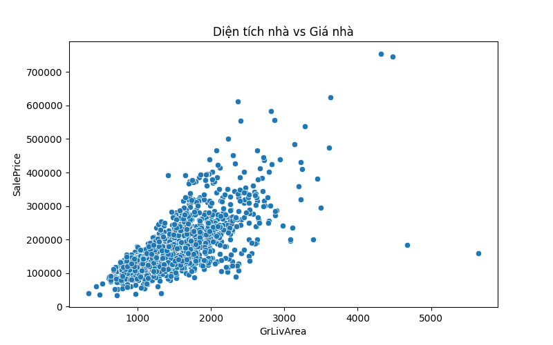

<<<<<<< HEAD
# House Price Prediction

This project predicts house prices using Machine Learning.

## Technologies
- Python
- Pandas
- Scikit-learn

## Project Structure

house-price-prediction
│
├── data
│   └── train.csv
│
├── main.py
└── dubaogianha.py

## How to run

pip install pandas scikit-learn

python main.py
## Data Visualization

Scatter plot showing relationship between house area and price.

=======
# House Price Prediction

## Introduction
This project predicts house prices using Machine Learning.  
The dataset used is the Ames Housing Dataset.

The goal is to build a regression model that predicts house prices based on several house features.

---

## Dataset
Dataset contains:

- 1460 houses
- 80 features
- Target variable: SalePrice

Dataset file:

data/train.csv

---

## Features Used

GrLivArea – Living area  
OverallQual – House quality  
GarageCars – Garage capacity

---

## Models Used

Linear Regression

Random Forest Regressor

---

## Evaluation

Metrics used:

MAE (Mean Absolute Error)

R² Score

---

## Run Project

Install libraries:

pip install -r requirements.txt

Run program:

python main.py

---

## Technologies

Python  
Pandas  
NumPy  
Matplotlib  
Seaborn  
Scikit-learn

---

## Author

GitHub:  
https://github.com/thienhavosong1
>>>>>>> 08b81f2ca4f95de8e43d1070a09604542e182b45
