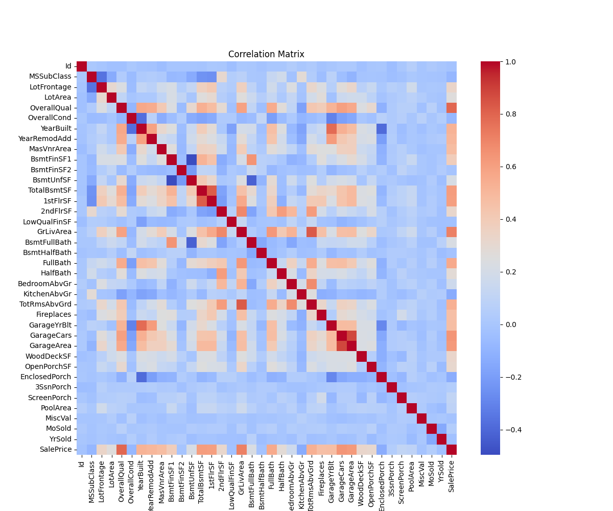
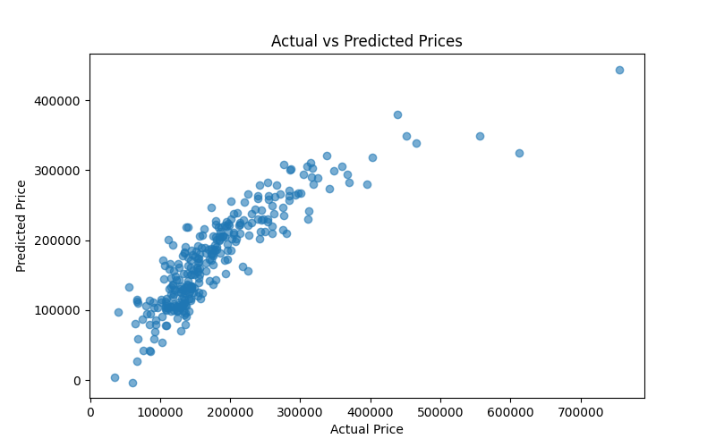
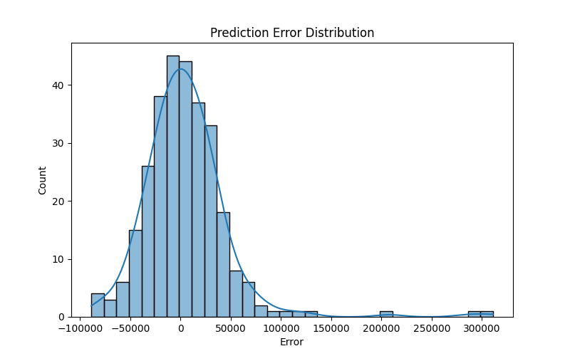
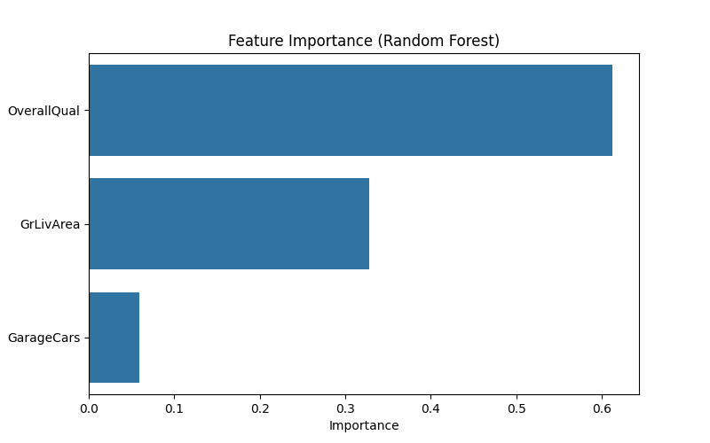

🏠 Dự đoán giá nhà bằng Machine Learning
📌 Tổng quan

Dự án này sử dụng Machine Learning để dự đoán giá bán của nhà dựa trên các đặc trưng của ngôi nhà.

Thông qua việc phân tích dữ liệu và huấn luyện mô hình học máy, chương trình có thể ước lượng giá bán của nhà dựa trên các yếu tố như:

GrLivArea – Diện tích sinh hoạt của ngôi nhà
OverallQual – Chất lượng tổng thể của ngôi nhà
GarageCars – Sức chứa của gara

Dự án bao gồm các bước chính:

Tiền xử lý dữ liệu (Data preprocessing)
Phân tích dữ liệu khám phá (EDA)
Huấn luyện mô hình (Model training)
Đánh giá mô hình (Model evaluation)
Trực quan hóa dữ liệu (Data visualization)
📊 Dataset

Dataset được sử dụng là Ames Housing Dataset trên Kaggle.

Nguồn dataset:
https://www.kaggle.com/competitions/house-prices-advanced-regression-techniques

Thông tin dataset:

1460 mẫu dữ liệu
80 thuộc tính (features) mô tả đặc điểm của ngôi nhà

Một số đặc trưng trong dataset gồm:

diện tích nhà
chất lượng xây dựng
số phòng
năm xây dựng
diện tích tầng hầm
sức chứa gara
giá bán của nhà

Biến mục tiêu cần dự đoán là:

SalePrice

## Biến mục tiêu cần dự đoán

Biến mục tiêu của mô hình là:

**SalePrice**

---

## Công nghệ sử dụng

| Công nghệ | Mục đích |
|---|---|
| Python | Ngôn ngữ lập trình |
| Pandas | Xử lý và phân tích dữ liệu |
| NumPy | Tính toán số học |
| Matplotlib | Vẽ biểu đồ |
| Seaborn | Trực quan hóa dữ liệu |
| Scikit-learn | Xây dựng mô hình Machine Learning |

---

## Quy trình Machine Learning

Quy trình thực hiện trong dự án gồm các bước:

1. Data preprocessing (tiền xử lý dữ liệu)
2. Exploratory Data Analysis (EDA)
3. Feature selection
4. Train/Test split
5. Model training
6. Model evaluation
7. Data visualization

🔄 Quy trình Machine Learning

Dự án thực hiện theo quy trình Machine Learning cơ bản:

Thu thập dữ liệu
Tiền xử lý dữ liệu
Phân tích dữ liệu (EDA)
Lựa chọn đặc trưng (Feature Selection)
Chia dữ liệu Train/Test
Huấn luyện mô hình
Đánh giá mô hình

## 📁 Cấu trúc dự án

house-price-prediction
│
├── data/
│ └── train.csv
│
├── images/
│ ├── price_distribution.png
│ ├── correlation_matrix.png
│ ├── area_vs_price.png
│ ├── prediction_vs_actual.png
│ ├── error_distribution.png
│ └── feature_importance.png
│
├── main.py
├── dubaogianha.py
├── model.pkl
├── requirements.txt
└── README.md

📂 Giải thích các file
data/

Thư mục chứa dataset dùng để huấn luyện mô hình Machine Learning.

images/

Chứa các biểu đồ được tạo ra trong quá trình phân tích dữ liệu.

main.py

Chương trình chính thực hiện các bước:

đọc dataset
xử lý dữ liệu
phân tích dữ liệu (EDA)
huấn luyện mô hình
đánh giá mô hình
tạo các biểu đồ
dubaogianha.py

Chương trình dùng để dự đoán giá nhà bằng mô hình đã được huấn luyện.

model.pkl

File lưu mô hình Machine Learning sau khi huấn luyện để có thể sử dụng lại.

requirements.txt

Danh sách các thư viện Python cần thiết để chạy dự án.

📈 Trực quan hóa dữ liệu
## Phân bố giá nhà

Phân bố giá nhà

Biểu đồ cho thấy phân bố giá nhà trong dataset.

## Correlation Matrix

Phân bố giá nhà

Biểu đồ cho thấy phân bố giá nhà trong dataset.

## Diện tích nhà và giá nhà

Diện tích nhà và giá nhà

Biểu đồ scatter thể hiện mối quan hệ giữa diện tích nhà và giá bán.

## So sánh giá thực tế và giá dự đoán

Diện tích nhà và giá nhà

Biểu đồ scatter thể hiện mối quan hệ giữa diện tích nhà và giá bán.

## Phân bố sai số dự đoán

So sánh giá thực tế và giá dự đoán

Biểu đồ so sánh giá nhà thực tế với giá nhà được mô hình dự đoán.

## Mức độ quan trọng của các đặc trưng

Phân bố sai số dự đoán

Biểu đồ thể hiện phân bố sai số của mô hình dự đoán.

🤖 Các mô hình Machine Learning

Dự án sử dụng hai mô hình Machine Learning.

Linear Regression

Mô hình hồi quy tuyến tính cơ bản dùng để dự đoán giá nhà.

Ưu điểm:

đơn giản
dễ hiểu
huấn luyện nhanh
Random Forest Regressor

Random Forest là thuật toán ensemble learning, kết hợp nhiều cây quyết định.

Ưu điểm:

độ chính xác cao
giảm hiện tượng overfitting
xử lý tốt dữ liệu phức tạp
📊 Đánh giá mô hình

Các mô hình được đánh giá bằng các chỉ số:

MAE (Mean Absolute Error)
RMSE (Root Mean Squared Error)
R² Score

Kết quả thực nghiệm cho thấy:

Random Forest Regressor cho hiệu suất tốt hơn Linear Regression.

🚀 Cách chạy chương trình
Clone repository
git clone https://github.com/thienhavosong1/house-price-prediction.git
Cài đặt thư viện
pip install -r requirements.txt
Huấn luyện mô hình
python main.py
Dự đoán giá nhà
python dubaogianha.py
🔧 Quản lý mã nguồn

Source code của dự án được quản lý bằng Git và lưu trữ trên GitHub.

Repository:
https://github.com/thienhavosong1/house-price-prediction

Git giúp:

quản lý phiên bản mã nguồn
theo dõi lịch sử thay đổi
hỗ trợ làm việc nhóm
📌 Kết luận

Dự án đã xây dựng thành công mô hình dự đoán giá nhà bằng Machine Learning.

Kết quả cho thấy:

Random Forest Regressor cho hiệu suất tốt hơn Linear Regression
các đặc trưng như diện tích sinh hoạt và chất lượng nhà có ảnh hưởng lớn đến giá nhà

Machine Learning có thể được áp dụng hiệu quả trong bài toán dự đoán giá bất động sản.

👨‍💻 Tác giả

Nhóm 6

Phạm Hữu Bằng – 698346 (Nhóm trưởng)
Lưu Quang Vinh – 698585

Machine Learning Project – House Price Prediction
