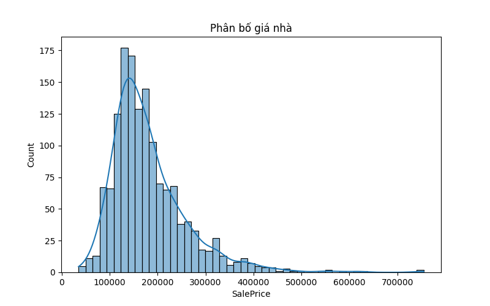

# House Price Prediction

This project predicts house prices using Machine Learning.
## Dataset

Dataset used: Ames Housing Dataset.

The dataset contains information about house properties such as:

- Living area
- Overall quality
- Garage capacity
- Sale price
## Technologies
- Python
- Pandas
- Scikit-learn

## Project Structure

house-price-prediction
│
├── data
│   └── train.csv
│
├── main.py
└── dubaogianha.py

## How to run

pip install pandas scikit-learn

python main.py
## Data Visualization
The following plot shows the distribution of house prices in the dataset.
### Distribution of House Prices
## Install libraries

pip install -r requirements.txt

